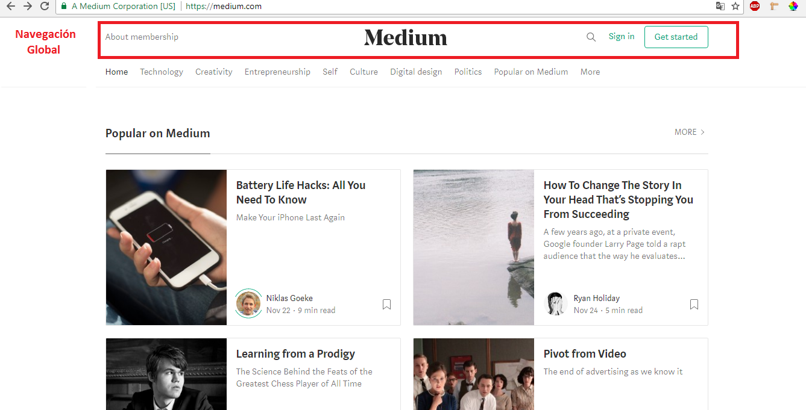

# RETO 2

Los tipos de navegación son los siguientes:

* Global : Es la navegación principal del site. Normalmente es persistente y nos ayuda a explorar todas las opciones del site.

* Local: Es la navegación “localizada” a una página o vista. En algunos casos, algunas páginas internas tienen su propia navegación que ayuda al usuario a explorar esa vista en particular.

* Facetada: Es la navegación a través de filtros no editables, definidos previamente por el sistema.

* Filtrada: En este tipo de navegación le damos al usuario todos los resultados de la búsqueda y le damos una serie de opciones de filtros para que él mismo pueda filtrar.

* Contextual: Es la navegación acorde al contexto en el que está navegando el usuario. Se usa principalmente para recomendaciones.

* Inline: Son links de referencia utilizados principalmente en artículos.

* Suplementaria: Es la navegación adicional, a veces temporal, utilizada para señalar algunas funciones a nuevos usuarios.

## Objetivo

Determinar los tipos de navegación en las siguientes páginas: 
* Breather
* Github
* Medium

### Breather

### Github

### Medium

